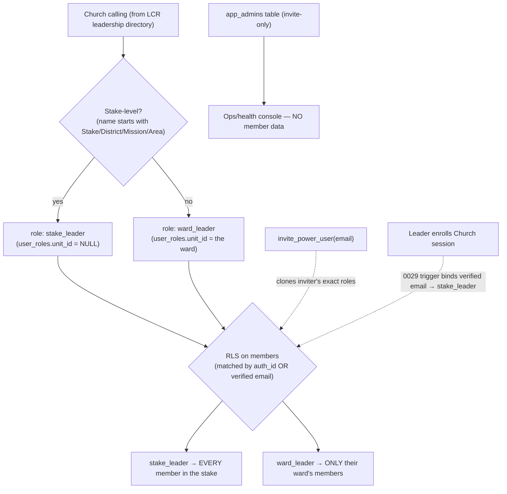

# Access Model — who can see what (privacy-sensitive)

**This is the authoritative, explicit map of access.** It enumerates every calling class, every
role, every data feature, and exactly what each can see. Member data is sensitive (covenant-path
progress, ordinances, ministering, contact info), so read this before changing anything that
touches `user_roles`, RLS policies, or the login gate.

> **One-sentence model:** A church **calling** → provisions a **role** (`stake_leader` /
> `ward_leader`) → **RLS** returns only that role's rows. Clients do **no** filtering; the database
> is the gate. Admins see system health only (never member data). Power users are exact clones of
> whoever invited them.

Sources of truth (change there, this doc follows): `lcr_client/access.py`, `backend/roles.py`,
`backend/onboarding.py`, `backend/auth_broker/enroll.py`, `backend/migrations/*.sql` (RLS).

---

## 1. The pipeline



---

## 2. Roles and exactly what each sees

| Role | Granted to | Scope (RLS) | Sees member PII? | Source |
|---|---|---|---|---|
| **`stake_leader`** | Any **stake-level** calling (see §3) | **Whole stake** — all wards/branches, all members | ✅ Yes — full covenant-path data for the stake | `roles.py` `provision_roles`; RLS in `0002_rls.sql` / `0004_rls_email.sql` |
| **`ward_leader`** | Any **ward/branch** calling that grants member-data access | **One unit** — only their ward's members | ✅ Yes — but only their ward | `roles.py` (per-unit loop) |
| **`app_admin`** | Invite-only (`app_admins`), owner-seeded | **System health/ops only** — freshness, Actions, sync diagnostics, login audit | ❌ **No member data** | `0008_app_admins.sql`; `is_admin()` |
| **Power user** | `invite_power_user(email)` — clones caller's roles | **Exactly what the inviter has** (escalation-safe; you can only clone what you hold) | Mirrors inviter | `0005_power_users.sql` |
| **Anonymous / no role** | Any signed-in email with no matching role | **Nothing** — empty app | ❌ No | RLS default-deny |

**Key invariant:** a signed-in user with **no** `user_roles` row sees **zero** member rows (RLS
default-deny). This is why the login gate (§5) can safely "err toward allowing" — letting someone
through never leaks data; they just see an empty app.

---

## 3. What makes a calling "stake-level" vs "ward-level"

A calling is **stake-scoped** (→ `stake_leader`, sees the whole stake) if its name **starts with**
one of these prefixes (`backend/roles.py` `_STAKE_PREFIXES`):

```
Stake   ·   District   ·   Mission   ·   Area
```

Everything else is **ward/branch-scoped** (→ `ward_leader`, sees only that unit).

---

## 4. Data-gating features (LCR access matrix → our fields)

A calling grants member-data access when LCR's access-table matrix maps its role to these features
(`lcr_client/access.py` `COVENANT_PATH_FEATURES`). `can_pull_all` = all **data** features granted.

| Feature key | What it unlocks | Member data? |
|---|---|---|
| `menu.progress.record` | New-member covenant-path list per unit **(core)** | ✅ |
| `menu.member.list` | Roster + birth dates | ✅ |
| `menu.view.member.profiles` | Baptism, patriarchal-blessing flag, priesthood office, ministering | ✅ |
| `menu.temple.recommend.status` | `temple_recommend` field | ✅ |
| `menu.patriarchal.blessing.status` | Patriarchal-blessing report | ✅ |
| `menu.ward.leadership` | *Who holds ward callings* — "who to ask" (a stake runner's view) | ⬜ who-to-ask only |
| `menu.stake.leadership` | *Who holds stake callings* — "who to ask" (a ward runner's view) | ⬜ who-to-ask only |

The last two are **perspective features** (`_PERSPECTIVE_FEATURES`): they carry *names to ask*, not
member data, and never make coverage "partial."

**`access_rank`** (`onboarding.py`): `can_pull_all` → **1000**; otherwise the **count** of granted
data features. Higher rank wins when several leaders of one stake enroll (a stake president's
session beats an assistant clerk's; a lower-access login never downgrades the stored credential).

---

## 5. The login authorization gate (decision table)

On every Church login the broker evaluates access (`enroll.py` `evaluate_and_maybe_store`). Only an
**explicit** "no access" blocks the client; uncertainty is allowed through (RLS still protects data).

| `can_pull_all` or `rank>0` or always-allowed calling? | `runner_positions` read? | Result | Client behavior |
|---|---|---|---|
| **Yes** | — | `authorized = allowed` | Signs in (sees their RLS scope) |
| No | **Yes** (positions present, none grant access) | `authorized = blocked` | Blocked: "your calling has no access" |
| No | **No** (empty probe — LCR hiccup) | `authorized = undetermined` | **Allowed through** (fixed 2026-06-08 — this was false-blocking stake presidents) |

Every evaluation is now recorded in **`login_audit`** (admin-only): email, stake, callings,
`authorized`, `access_rank`, `can_pull_all`, outcome. Use it to debug "leader X can't log in."

### Always-allowed safety net (stake stewardship)
These stake callings get data access **even if LCR's menu matrix is incomplete**
(`backend/roles.py` `_ALWAYS_ALLOWED_CALLINGS`, substring match — so "First Counselor in the Stake
Presidency" matches "Counselor in the Stake Presidency"):

```
Stake President               Counselor in the Stake Presidency   Stake Presidency
Stake Clerk                   Stake Assistant Clerk
Stake Executive Secretary     Stake Assistant Executive Secretary
High Council
```

---

## 6. Roles are provisioned automatically (no manual assignment)

`backend/roles.py` `provision_roles` rebuilds `user_roles` for a stake from its **leadership
directory** on every sync:

1. **Stake leaders** ← stake-prefixed callings from `/mlt/api/orgs` (fallback: leadership directory).
2. **Ward leaders** ← per-unit bishopric/leadership, if the calling grants member-data access
   (matrix union **or** always-allowed).
3. A calling can view data if `p["role_id"] in matrix-union` **OR** `_calling_always_allowed(name)`.
4. **Revoke gating:** if both directory sources come back empty we do **not** treat it as "everyone
   released" (that once revoked an entire stake) — the revoke step is gated on a non-empty read
   (`stake_ok` / `ward_ok`), mirroring the sync's `failed_units` gating.

Email/OAuth logins are matched to roles by **verified email**; calling-derived rows are keyed by LCR
**person UUID**. The provider-binding trigger (`0029`) binds a freshly-enrolled leader's verified
email to a stake-wide `stake_leader` row so they see their stake immediately.

**Every other provisioned leader binds on their first Church login** (`0043` +
`enroll._bind_identity_email`): `/api/auth/me` returns `churchCMISUUID`, which **is** the LCR person
UUID the role rows are keyed by (probe-verified), so the broker stamps the login's verified email
onto that person's `user_roles` rows on every Church login — idempotent, zero added LCR calls, and
the nightly upsert preserves it. Until a leader's first Church login their calling-derived rows have
no email and they see an empty app (`login_audit.role_scope = 'none'` is the tell); afterwards plain
email/Google sign-ins with the same address match too.

---

## 7. Privacy summary (read this)

- **Member PII** (covenant-path progress, ordinances, ministering, contact, birth/baptism dates)
  lives only in Supabase `members`, **RLS-scoped**. It is **never** in the repo and **never**
  returned to a client outside its role scope.
- **Admins see system health, not members.** `is_admin()` gates ops/health/freshness/Actions and the
  new `login_audit` — none of which expose member rows.
- **`login_audit` holds sign-in emails** → **admin-only** by RLS (`0033`). The broker writes it with
  the service-role key; no client can read another person's login record.
- **Least privilege on write:** the scraper writes via the `postgres`/service role (bypasses RLS to
  write freely); every **client read** stays RLS-scoped. Service-role grants are explicit and
  minimal (`0010`, `0021`, `0033`).
- **Credentials are never stored in plaintext:** enrolled Church sessions are envelope-encrypted
  (`CP_TOKEN_KEY`); passwords are never stored.

---

## 8. Extending the model ("map it + add new")

Today the calling→role mapping is **code + LCR matrix**, not a UI. To add/adjust:

- **Add a stake-stewardship calling to the safety net:** append to `_ALWAYS_ALLOWED_CALLINGS`
  (`backend/roles.py`). Substring match, so use the shortest unique form.
- **Change stake-vs-ward scoping:** `_STAKE_PREFIXES` (`backend/roles.py`).
- **Add a gated data feature:** `COVENANT_PATH_FEATURES` (`lcr_client/access.py`) + the report.

A future **admin "roles map" UI** (queued) would surface this table and let an admin add mappings
without a deploy — backed by a small `calling_access_overrides` table unioned into `provision_roles`
and the login gate. Until then, this doc + those three lists are the contract.

---

*Generated 2026-06-08. If you change `_ALWAYS_ALLOWED_CALLINGS`, `_STAKE_PREFIXES`,
`COVENANT_PATH_FEATURES`, the RLS policies, or the login gate, update this doc in the same commit.*
